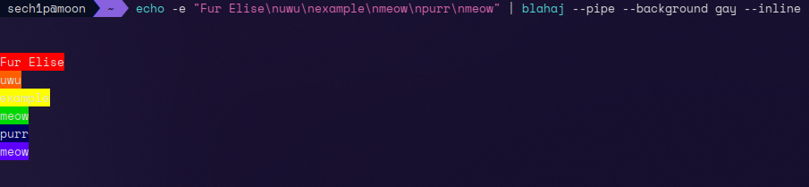

# 🦈 Blahaj

<p align="center">
    
    <br />
    
    <br />
    <i>(pssst. use <code>blahaj</code> instead of <code>npm start</code>/</code>node dist/index.js ...</code> because it's only for development purposes)</i>
</p>

## ❓ ~~OwO~~, what's this?

`blahaj` is a simple command line program to display in photo or ascii art our beloved shark from IKEA

## ⚠️ Important

`blahaj` for rendering plushie shark image in HD is dependent on [viu](https://github.com/atanunq/viu).
However, not on every terminals blahaj are rendered correctly. `blahaj` is tested under KDE 6 desktop environment (Konsole as terminal) and Arch Linux.

If blahaj is not except your expectations or you want fix it under your configuration then feel free to making [issue](https://github.com/sech1p/blahaj/issues) or [Pull Request](https://github.com/sech1p/blahaj/pulls). Thanks!

Ensure that you have latest version of node installed (not LTS preffered), otherwise older versions of node.js will not recognize few imports (like `node:module`)

## ❓ Usage

```sh
$ blahaj --help
Usage: blahaj [options] [command]

🦈 Display blahaj in your terminal!

Options:
  -V, --version        output the version number
  -p, --pipe <param>   pipe text to queer colors in terminal (param: background [-b, --background] || text [-t, --text] or both)
  
  Available backgrounds:
  
    gay
    bi
    lesbian
  
  Available texts:

    -

  -c, --classic        output the blahaj in legacy way by jimp (low quality so you are warned!)
  -b, --baby           output the baby blahaj
  -h, --help           display help for command

Commands:
  ascii_art [options]  display blahaj as ascii art

$ blahaj ascii_art --help
Usage: blahaj ascii_art [options]

display blahaj as ascii art

Options:
  --no-unicode [integer]  displays ascii art without unicode characters of blahaj
  
  Available options (integer, not required):
  
    2
    3
  
  --default               displays default ascii art (unicode) of blahaj
  --pride <string>        select pride color of ascii art haj [gay, lesbian, transgender, nonbinary, poly]
  -h, --help              display help for command

$ blahaj

# In classic modes you can specify width and height of blahaj by "width <integer> height <integer>"
# For example:
#
# $ blahaj --classic width 50 height 50
#
# $ blahaj --baby classic width 50 height 50
#

$ blahaj --classic

$ blahaj --baby

$ blahaj --baby classic

$ blahaj ascii_art --default # (or --pride or --no-unicode)

$ blahaj ascii_art --no-unicode

$ cat example_file_meow.txt | blahaj --pipe --background gay
```

## 💾 Installation

To install `blahaj` in your computer, you need to use `npm install -g @sech1p/blahaj` command or download single binary from [releases](https://github.com/sech1p/blahaj/releases). That's it.

Also, if you are Arch Linux or -like distribution user you can get blahaj from [AUR](https://aur.archlinux.org/packages/blahaj-cli).

Additionally, you need `viu` command which you can download it from [here](https://github.com/atanunq/viu). This allows to render blahaj in high quality.

## 🗺️ Roadmap

✨ Plans for v0.2.0 (done):

- [X] Binaries
- [X] More ascii art blahajs
- [X] Different color blahajs (there are only basic flags because there is no enough colorous square emojis to do it)
- [X] Ascii art without unicode
- [X] Change width and height of rendered blahaj

✨ Plans for v0.3.0:

- [X] Highlightning text on pipe
- [ ] Pride flags

## 🗒️ License

`blahaj` is licensed under [Apache-2.0](LICENSE) license.

All trademarks, logos and brand names are the property of their respective owners. All company, product and service names used in this website are for identification purposes only. Use of these names, trademarks and brands does not imply endorsement.
