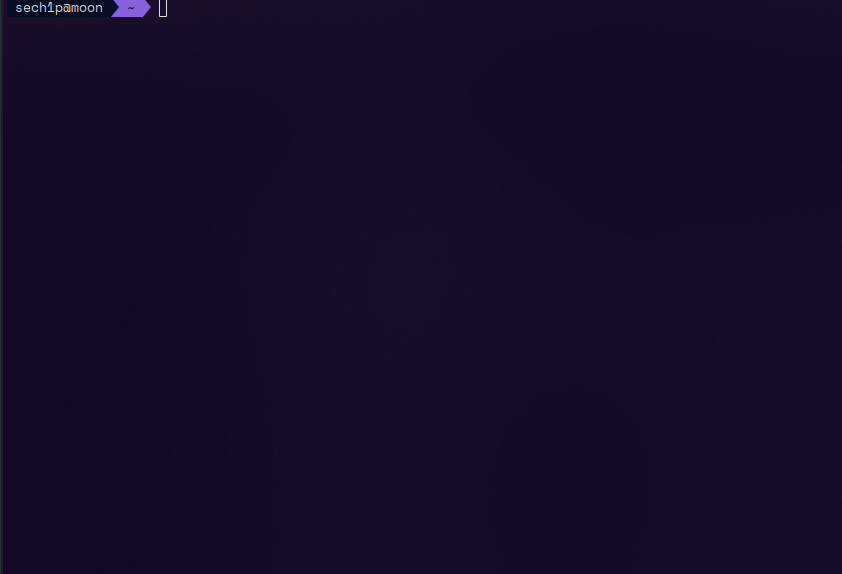

# 🦈 Blahaj

<p align="center">
    
</p>

## ❓ ~~OwO~~, what's this?

`blahaj` is a simple command line program to display in photo or ascii art our beloved shark from IKEA

## ❓ Usage

```sh
$ blahaj --help
Usage: blahaj [options] [command]

🦈 Display blahaj in your terminal!

Options:
  -V, --version        output the version number
  -c, --classic        output the blahaj in legacy way by jimp (low quality so you are warned!)
  -b, --baby           output the baby blahaj (use classic keyword after --baby argument if you want render it by legacy way)
  -h, --help           display help for command 

Commands:
  ascii_art [options]  display blahaj as ascii art

$ blahaj

$ blahaj --classic

$ blahaj --baby

$ blahaj --baby classic

$ blahaj ascii_art --default # (or --pride)
```

## 💾 Installation

To install `blahaj` in your computer, you need to use `npm install -g @sech1p/blahaj` command or download single binary from [releases](https://github.com/sech1p/blahaj/releases). That's it.

Additionally, you need `viu` command which you can download it from [here](https://github.com/atanunq/viu). This allows to render blahaj in high quality.

## 🗺️ Roadmap

✨ Plans for v0.2.0:

- [X] Binaries
- [ ] More ascii art blahajs
- [ ] Different color blahajs
- [ ] Ascii art without unicode
- [ ] Change width and height of rendered blahaj

✨ Plans for v0.3.0:

- [ ] Highlightning text on pipe
- [ ] Pride flags

## 🗒️ License

`blahaj` is licensed under [Apache-2.0](LICENSE) license.

All trademarks, logos and brand names are the property of their respective owners. All company, product and service names used in this website are for identification purposes only. Use of these names, trademarks and brands does not imply endorsement.
